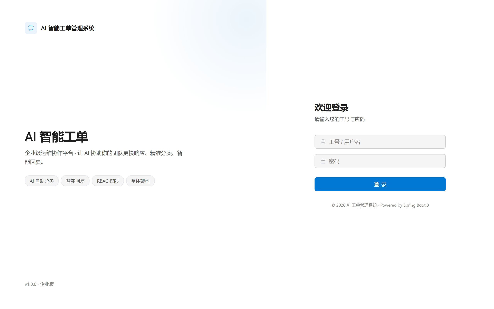
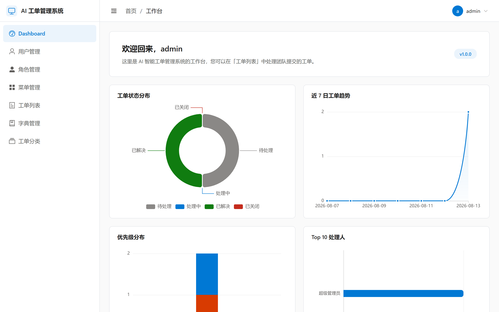
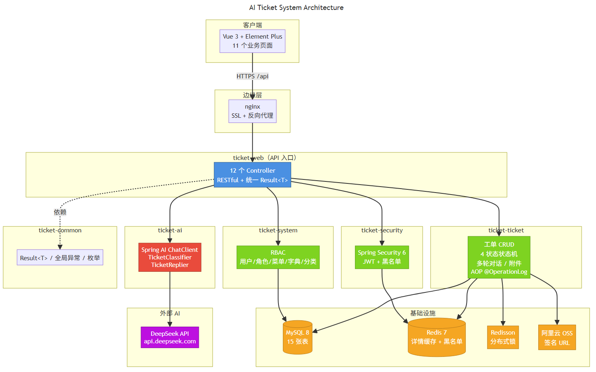
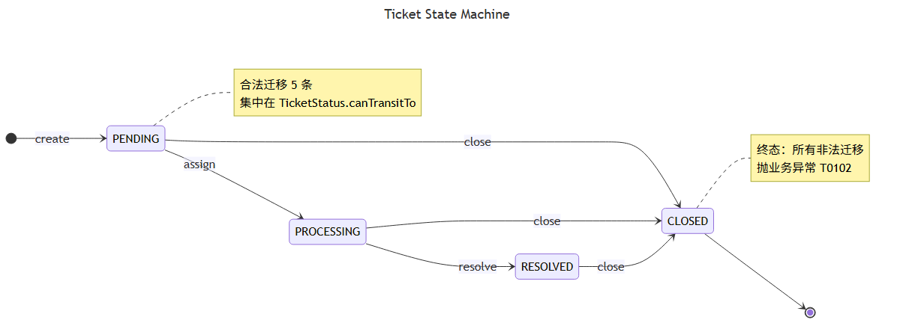

# AI 智能工单管理系统

> 基于 Spring Boot 3 + Vue 3 + DeepSeek 的企业级单体工单管理系统，集成 AI 实现工单自动分类与智能回复辅助。

## 界面截图

### 登录页


### 统计 Dashboard


## 📖 项目简介

本项目面向企业内部员工的报障场景，解决「工单流程冗长、分类依赖人工、客服响应慢」的问题。系统覆盖工单**创建 → 智能分类 → 分配 → 多轮对话 → 解决 → 关闭**的全生命周期，并基于 DeepSeek 实现创建时的自动分类与详情页的 AI 智能回复建议，AI 失败**双层降级**不阻塞主流程。

设计上强调**工程韧性**：状态机集中校验、Redis 三层缓存防护、AOP 自定义注解审计、两层 RBAC + JWT 黑名单、MySQL 联合索引 EXPLAIN 验证。6 模块 Maven 多模块架构，共 **358 个测试用例**，Docker 单镜像可部署至阿里云 ECS。

## ✨ 核心功能

- **工单全生命周期管理**：内置 4 状态状态机（`PENDING → PROCESSING → RESOLVED → CLOSED`），5 条合法迁移集中在 `TicketStatus.canTransitTo` 静态方法校验，非法迁移抛统一业务码 `T0102`；每次状态变更同事务写 `ticket_log` 业务事件流。
- **AI 智能辅助**：集成 Spring AI 1.x `ChatClient` + DeepSeek（OpenAI 兼容协议），业务层只看到 `TicketClassifier` / `TicketReplier` 两个 interface；创建工单同步发起分类（2s 短超时降默认分类），详情页"AI 智能回复"按钮基于多轮对话历史生成回复建议，所有调用落 `ai_ticket_record` 审计表。
- **AI 双层降级**：第一层 `DeepSeekClassifier` / `DeepSeekReplier` 内部 `try-catch` 接住 Spring AI 异常并写 `error_log`；第二层业务方（`ticket-ticket`）拿到兜底值后继续推进，不阻塞工单创建。
- **权限与安全**：Spring Security 6 + **JWT 单 token**（30 分钟过期）+ Redis 黑名单登出；两层 RBAC（菜单权限 + `@PreAuthorize("hasAuthority('ticket:create')")` 操作权限）；密码 BCrypt 自适应哈希。
- **高性能缓存**：工单详情走 Redis 缓存 + **空值防穿透** + **Redisson 分布式锁防击穿** + **TTL ±5min 随机抖动防雪崩**；写失效用 `TransactionSynchronizationManager` 挂 after-commit，事务回滚不清缓存。
- **AOP 操作审计**：自定义 `@OperationLog` 注解 + AOP 切 Controller 边界，自动记录调用者 / API / 入参出参 / IP / UA 到 `operation_log` 表。
- **可视化运营**：ECharts Dashboard 4 张统计图（状态分布 / 优先级分布 / 趋势折线 / TopN 处理人），Redis 5min 聚合缓存。
- **数据导出与附件**：Apache EasyExcel 工单列表导出（流式 API，十万行不 OOM）；阿里云 OSS 私有 Bucket 签名 URL 上传 / 下载附件，无 OSS 账号时降级本地文件系统。

## 🛠 技术栈

| 层次 | 技术选型 |
| :--- | :--- |
| **后端框架** | Java 17, Spring Boot 3.2, Spring MVC, Spring Security 6 |
| **AI 集成** | Spring AI 1.x `ChatClient` + DeepSeek（OpenAI 兼容端点） |
| **数据访问** | MyBatis Plus, MySQL 8（InnoDB），联合索引 + EXPLAIN 验证 |
| **缓存与分布式** | Redis, Redisson（分布式锁 + 看门狗） |
| **工具库** | Apache EasyExcel（导出）, Knife4j（API 文档）, 阿里云 OSS SDK |
| **定时与调度** | Spring Task（`@Scheduled`，日报聚合 + 黑名单清理） |
| **测试** | JUnit 5, Mockito, Spring Boot Test（H2 + MockMvc），358 个用例 |
| **前端框架** | Vue 3, TypeScript, Vite, Element Plus, Pinia, Axios |
| **前端可视化** | ECharts（4 图 Dashboard） |
| **E2E 测试** | Playwright（mock 后端，全链路登录 → 主布局 → 工单列表） |
| **部署运维** | Maven 多模块单 fat jar, Docker（eclipse-temurin:17-jre-alpine, 非 root）, 阿里云 ECS, nginx 反向代理 |

## 🧩 模块结构

项目采用 Maven 多模块架构，单向依赖，业务模块间禁止互相调用：

    ticket-web          Controller 层 / 启动类 / application.yml
    ticket-common       Result<T> / 业务异常 / 全局异常处理 / 公共枚举
    ticket-security     Spring Security 6 / JWT / Redis 黑名单 / @PreAuthorize
    ticket-system       用户 / 角色 / 菜单 / 数据字典 / 工单分类（RBAC）
    ticket-ticket       工单 CRUD / 4 状态机 / 评论 / 附件 / Redis 缓存 / AOP 日志
    ticket-ai           Spring AI ChatClient / TicketClassifier / TicketReplier

依赖关系：`ticket-web` → `ticket-security / ticket-system / ticket-ticket / ticket-ai / ticket-common`；业务模块 → `ticket-common`；`ticket-common` → （无）。

## 📐 系统架构可视化

### 整体架构



> 客户端 → nginx → `ticket-web`（12 个 Controller） → 5 个业务模块 → MySQL / Redis / Redisson / 阿里云 OSS / DeepSeek API。

### 工单状态机



> 4 状态 + 5 条合法迁移；非法迁移抛业务异常 `T0102`；迁移规则集中在 `TicketStatus.canTransitTo` 静态方法校验。

## 🚀 快速启动

### 环境要求

- JDK 17+
- Maven 3.8+
- MySQL 8.0+
- Redis 6.0+
- Node 18+（前端）
- DeepSeek API Key（可选：不设置也能启动，AI 分类/回复走降级；设置 `DEEPSEEK_API_KEY` 环境变量启用 AI）

### 运行步骤

1. **克隆项目**

    ```bash
    git clone <你的仓库地址>
    cd AI-Ticket-Management
    ```

2. **初始化数据库**

    MySQL 中创建数据库：

    ```sql
    CREATE DATABASE ai_ticket_system DEFAULT CHARACTER SET utf8mb4;
    ```

    首次启动 Spring Boot 时会自动执行 `ticket-system/src/main/resources/db/mysql/schema.sql` 建表 + `data.sql` 种子数据，并写入默认账号 `admin / admin123`（登录后请立即改密）。

3. **修改配置（可选）**

    编辑 `ticket-web/src/main/resources/application.yml`，或通过环境变量覆盖：

    ```bash
    export MYSQL_URL='jdbc:mysql://localhost:3306/ai_ticket_system?useUnicode=true&characterEncoding=utf8&serverTimezone=Asia/Shanghai&allowPublicKeyRetrieval=true&useSSL=false'
    export MYSQL_USERNAME=root
    export MYSQL_PASSWORD=<你的密码>
    export REDIS_HOST=localhost
    export REDIS_PASSWORD=<你的Redis密码>
    export JWT_SECRET=<至少32字节随机串>
    export DEEPSEEK_API_KEY=<你的DeepSeek Key>   # 可选
    ```

4. **启动后端**

    ```bash
    # 方式一：IDE 直接运行 ticket-web 的 AiTicketSystemApplication
    # 方式二：命令行打包运行
    mvn -B clean package -DskipTests
    java -jar ticket-web/target/ticket-web-1.0.0.jar
    ```

    启动成功后健康检查：`curl http://localhost:8080/api/v1/ping` 返回 `{"code":"200","message":"success","data":"pong"}`。API 文档：`http://localhost:8080/doc.html`（Knife4j）。

5. **启动前端**

    ```bash
    cd ticket-ui
    npm install
    npm run dev          # 默认 5173 端口，/api 自动代理到 localhost:8080
    ```

    浏览器打开 `http://localhost:5173`，使用 `admin / admin123` 登录。

### 验证清单

- ✅ 后端 `ping` 接口返回 `pong`
- ✅ Knife4j 能打开（`/doc.html`）并看到 12 个业务 Controller
- ✅ 前端登录页能跳转到主布局（`Dashboard` + `工单列表` 可见）
- ✅ 创建工单后，可在详情页点击「AI 智能回复」按钮（无 Key 时返回模板回复）

## 🧪 测试

```bash
mvn -B test         # 后端全模块 358 个用例全绿
cd ticket-ui && npm run test       # 前端 Vitest 单测
cd ticket-ui && npm run test:e2e   # Playwright mock E2E（登录 → 主布局 → 工单列表）
```

测试覆盖重点：状态机 62（笛卡尔积全集）、工单 CRUD 11、认证 36、Redis 缓存 9、AI 分类/回复 6、Prompt 模板渲染 3。详见 `docs/test-summary.md`。

## 📦 部署

```bash
mvn -B clean package -DskipTests
docker build -t ai-ticket-system:1.0.0 .
docker run -d --name ai-ticket -p 8080:8080 \
  -e MYSQL_URL=<jdbc-url> -e MYSQL_USERNAME=root -e MYSQL_PASSWORD=<密码> \
  -e REDIS_HOST=<host> -e JWT_SECRET=<随机串> \
  -e DEEPSEEK_API_KEY=<你的Key> \
  ai-ticket-system:1.0.0
```

完整的阿里云 ECS 部署手册（实例规格 / 安全组 / Docker 安装 / MySQL+Redis / 域名+SSL / nginx 反代 / 日志轮转）见 `docs/deployment/aliyun-ecs.md`。Docker 镜像压缩后约 162 MB。

## 📄 开源协议

本项目采用 MIT License 开源协议。

## ✉️ 关于作者

本项目是我为准备**第一次实习面试**而独立设计并实现，旨在展示**后端工程能力与 AI 集成实践**。

- 技术亮点：Spring AI 集成 + 双层降级 / 工单状态机 + 业务事件流 / Redis 三层缓存防护 / AOP 自定义注解审计 / 两层 RBAC + JWT 黑名单 / MySQL 联合索引 EXPLAIN 验证 / Vue 3 自研 `v-permission` 指令 / Playwright E2E

## 相关文档

- [docs/deployment/aliyun-ecs.md](docs/deployment/aliyun-ecs.md)：阿里云 ECS 部署手册
- [docs/test-summary.md](docs/test-summary.md)：测试摘要
- [docs/resume-project-description.md](docs/resume-project-description.md)：简历项目描述

> 注：`CONTEXT.md`（领域词汇表）与 `docs/adr/`（架构决策记录）为本地协作文档，未纳入版本控制。